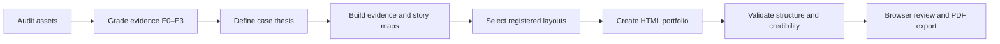

<div align="center">

# Industrial Design Portfolio Skill

### Turn product-design evidence into a portfolio that proves judgment.

[简体中文](README.zh-CN.md) · English

> ⭐ **If this project helped you, a star is the easiest way to say thanks — and helps others find it.**
> 若这个项目对你有用，点个 Star 就是最简单的鼓励，也能帮更多人发现它。


</div>

An evidence-first Agent Skill for creating, restructuring, and reviewing industrial design portfolios. It turns research, sketches, CAD, CMF studies, prototypes, tests, manufacturing notes, and final imagery into a coherent horizontal HTML case study—without fabricating the process that is missing.

> A polished render shows taste. A strong portfolio shows what you noticed, what you changed, and why the result deserves trust.

## What makes it different

- **Evidence before decoration** — every important claim is linked to a source, artifact, or explicit assumption.
- **Industrial-design depth** — covers users, form, CMF, ergonomics, product architecture, manufacturing, prototyping, and iteration.
- **Portfolio-native storytelling** — supports a 12–18 page case study, a 20–36 page multi-project portfolio, and short interview cuts.
- **18 registered layouts** — purpose-built for briefs, evidence walls, concept divergence, selection matrices, CMF, architecture, manufacturing, testing, iteration, and final resolution.
- **AI disclosure by design** — generated concepts cannot silently become fake research, prototypes, CAD, or engineering evidence.
- **Cross-agent runtime** — works with Codex, Claude Code, Cursor, Gemini CLI, OpenCode, and generic Agent Skills runtimes.
- **Deterministic quality gates** — includes HTML and manifest validators, a P0–P3 checklist, adapter synchronization, and six executable behavior rubrics.

## Portfolio workflow



The workflow evaluates five connected design lenses:

| Lens | What the portfolio should prove |
|---|---|
| User and context | The need is observed rather than invented |
| Industrial design and CMF | Form and material decisions follow intent |
| Product architecture | Components, interfaces, and service paths make sense |
| Manufacturing and viability | Process and cost claims expose their assumptions |
| Differentiation and learning | Alternatives, trade-offs, tests, and changes are visible |

## Output

```text
portfolio/
├── index.html                 # Horizontal, responsive portfolio deck
├── images/                    # Research, process, CAD, prototypes, final work
├── portfolio_manifest.json    # Schema-checked audience, roles, evidence, assumptions, layouts
└── source_notes.md            # Sources, authorship, disclosures, unresolved gaps
```

The bundled template is a single-file responsive HTML deck with keyboard, wheel, touch, reduced-motion, and print/PDF behavior.

## Quick install

### Skills CLI

```bash
npx skills add truman-t3/industrial-design-portfolio-skill \
  --skill industrial-design-portfolio --global
```

### Clone and install

```bash
git clone https://github.com/truman-t3/industrial-design-portfolio-skill.git
cd industrial-design-portfolio-skill

# Choose one runtime
python scripts/install_skill.py --platform codex --scope user
python scripts/install_skill.py --platform claude --scope user
python scripts/install_skill.py --platform cursor --scope user
python scripts/install_skill.py --platform gemini --scope user
python scripts/install_skill.py --platform opencode --scope user
```

For a project-local neutral installation:

```bash
python scripts/install_skill.py --platform agents --scope project
```

Use `python3` instead of `python` when required by your system.

## Example prompts

```text
Use $industrial-design-portfolio to turn my research notes, sketches,
CAD screenshots, and prototype photos into a 14-page case study.
```

```text
Review my 28-page portfolio for a junior industrial designer role.
Tell me what to cut, what evidence is missing, and propose a new page order.
```

```text
Build a three-project portfolio for a senior product designer application.
Prioritize role clarity, manufacturing collaboration, and measurable iteration.
```

## Evidence, not theatre

The Skill uses four evidence levels:

| Level | Meaning | Portfolio treatment |
|---|---|---|
| E0 | Unsupported idea or model suggestion | Mark as `Assumption` |
| E1 | Supplied but unverified material | Cite and caveat |
| E2 | Direct project evidence | Present with authorship and context |
| E3 | Independently verifiable result | Cite origin and date |

Visual polish never raises an evidence level. AI-generated exploded artwork is a conceptual architecture illustration—not a manufacturable drawing.

## Cross-agent architecture

`SKILL.md` is the canonical source. Platform adapters are generated from it:

```text
SKILL.md                 # Canonical Agent Skill
├── AGENTS.md            # Agent-neutral persistent adapter
├── CLAUDE.md            # Claude Code adapter
├── GEMINI.md            # Gemini CLI adapter
├── agents/openai.yaml   # Codex UI metadata
├── assets/              # Original HTML portfolio template
├── references/          # Story, evidence, layouts, visual system, QA
├── scripts/             # Install, sync, and validate
├── schemas/             # Portfolio-manifest contract
└── evals/               # Platform-neutral rubrics and fixture observations
```

After changing `SKILL.md`, regenerate and verify adapters:

```bash
python scripts/sync_adapters.py
python scripts/sync_adapters.py --check
```

## Validation

Validate a generated portfolio:

```bash
python scripts/validate_manifest.py path/to/portfolio/portfolio_manifest.json
python scripts/validate_portfolio.py path/to/portfolio/index.html
python scripts/run_evals.py --all
```

`run_evals.py` checks structured evaluator observations against the six bundled rubrics; it does not claim to execute a model. Delivery is blocked by P0 credibility failures or P1 comprehension/accessibility failures. P2 and P3 findings are reported as design polish.

## Design principles

1. Show decisions, not a diary.
2. Preserve original evidence before generating imagery.
3. Separate design intent from engineering proof.
4. State individual responsibility inside team projects.
5. Match layouts to evidence shape, not decorative variety.
6. End each project with resolution and reflection—not an unexplained render.

## Project lineage

This is an original implementation informed by three useful open-source patterns:

- [`michaelboeding/skills`](https://github.com/michaelboeding/skills/tree/master/skills/product-engineer-agent) — multi-lens product development.
- [`op7418/guizang-ppt-skill`](https://github.com/op7418/guizang-ppt-skill) — story rhythm, layout discipline, image-slot planning, and graded QA.
- [`truman-t3/shijing-skill`](https://github.com/truman-t3/shijing-skill) — canonical instructions, cross-agent adapters, installation, and evals.

No template or source code from `guizang-ppt-skill` is copied into this project.

## Version

Current release: **v1.1.0**

- Evidence-first industrial design portfolio workflow
- MIT licensed for clear reuse
- Schema-checked evidence, authorship, AI disclosure, and layout manifest
- Original responsive HTML deck template
- 18 registered industrial design layouts
- Cross-agent adapters and installer
- Structural validator and six executable behavior rubrics
