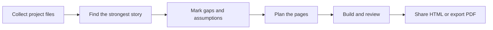

<div align="center">

# Industrial Design Portfolio Skill

### Turn product-design evidence into a portfolio that proves judgment.

English · 简体中文（本页下方）

> ⭐ **If this project helped you, a star is the easiest way to say thanks — and helps others find it.**
> 若这个项目对你有用，点个 Star 就是最简单的鼓励，也能帮更多人发现它。


[](https://github.com/truman-t3/industrial-design-portfolio-skill/actions/workflows/validate.yml)
[](https://truman-t3.github.io/industrial-design-portfolio-skill/)

</div>

If your project folder contains research notes, sketches, CAD screenshots, renderings, model photos, or test records, you already have enough to begin.

Give that folder to your Agent. This Skill helps it:

1. find the strongest story in the work you actually did;
2. show decisions, alternatives, trade-offs, and your personal role;
3. identify important proof that is still missing;
4. turn the result into an editable HTML portfolio that can also be printed to PDF.

It will not invent research, prototypes, tests, manufacturing decisions, or project outcomes just to make the portfolio look complete.

## Choose what you need

| Your situation | Ask the Skill to |
|---|---|
| You have a folder of mixed project files | Build one clear 12–18 page case study |
| You already have a portfolio | Review what to cut, reorder, explain, or support with better proof |
| You have too many projects | Select the projects that best fit a role, school, or audience |
| Your process is incomplete | Separate what is proven, remembered, assumed, and still needs validation |

### 30-second start

```bash
npx skills add truman-t3/industrial-design-portfolio-skill \
  --global --skill industrial-design-portfolio --yes --copy
```

Then give your Agent a project folder and say:

```text
Use $industrial-design-portfolio to review my project files and turn them
into a 14-page industrial design case study. Clearly mark anything that
still needs evidence.
```

## See the result


**Modular Desk Lamp** is a fictional 14-page example showing how rough material can become a clear design story while assumptions and AI-assisted images remain honestly labelled.

| Starting material | What the Skill does | Deliverable |
|---|---|---|
| Brief, sketches, process notes, CAD/renderings, prototype or test records | Finds the story → checks support → plans pages → builds and reviews the portfolio | Responsive 14-page HTML portfolio |

[Open the live 14-page Showcase](https://truman-t3.github.io/industrial-design-portfolio-skill/) · [View the HTML source](showcase/modular-desk-lamp/index.html) · [Read the storyboard](showcase/modular-desk-lamp/storyboard.md) · [Inspect the evidence manifest](showcase/modular-desk-lamp/portfolio_manifest.json)

> **Fictional demonstration:** AI-assisted images illustrate design intent only. They are not user research, physical prototypes, CAD, test results, or engineering proof.

## How it helps

- **Find the story** — identify the project question, the turning points, and the final design decision.
- **Show your judgment** — explain why one direction was chosen and what changed after feedback or testing.
- **Make your role clear** — separate personal contributions from team work and supplied assets.
- **Use the right pages** — choose from 18 industrial-design layouts for research, concepts, CMF, architecture, manufacturing, testing, iteration, and final outcomes.
- **Keep it honest** — label assumptions and AI-assisted concepts instead of presenting them as real research or engineering proof.
- **Finish the artifact** — create a responsive portfolio for browser review, interviews, and PDF export.

## From project folder to portfolio



Behind these simple steps, the Skill checks five questions a reviewer is likely to ask:

| Reviewer question | What the portfolio should make clear |
|---|---|
| Did you understand a real need? | The context comes from observation or supplied evidence, not hindsight |
| Why does it look and feel this way? | Form, CMF, and ergonomic choices follow a clear intent |
| Could the product work as a system? | Components, interfaces, assembly, and service paths make sense |
| Are the feasibility claims credible? | Manufacturing and cost statements expose their assumptions |
| What did you learn and change? | Alternatives, trade-offs, feedback, tests, and iterations are visible |

## What you receive

```text
portfolio/
├── index.html                 # The editable, responsive portfolio
├── images/                    # Research, sketches, CAD, prototypes, and final work
├── portfolio_manifest.json    # A machine-readable record of roles, evidence, and open questions
└── source_notes.md            # Sources, authorship, AI disclosures, and missing proof
```

Most designers only need to open `index.html` and work with the `images` folder. The other two files help the Agent keep claims, authorship, and missing evidence consistent. The portfolio supports keyboard, wheel, touch, reduced-motion, and print/PDF use.

## Install

Choose one method. Most designers only need Option A or B.

### Option A — ask your Agent

No terminal commands are required. Send this message to Codex or another Agent that can install skills:

```text
Install industrial-design-portfolio for the current user from:
https://github.com/truman-t3/industrial-design-portfolio-skill

After installation, confirm that the skill name is
industrial-design-portfolio and tell me whether I need to start a new session.
```

### Option B — use the Skills CLI

This method requires [Node.js 18 or newer](https://nodejs.org/). The CLI does not need to be installed globally.

First, check that the repository exposes the expected Skill:

```bash
npx skills add truman-t3/industrial-design-portfolio-skill --list
```

Install globally for Codex:

```bash
npx skills add truman-t3/industrial-design-portfolio-skill \
  --global --agent codex --skill industrial-design-portfolio --yes --copy
```

For Claude Code, replace `codex` with `claude-code`. To install with the CLI's interactive Agent selection:

```bash
npx skills add truman-t3/industrial-design-portfolio-skill --all
```

Check the installation or update installed skills:

```bash
npx skills list --global --agent codex
npx skills update --global --yes
```

After installing or updating, start a new Agent session so its skill list is refreshed.

### Option C — clone and use the bundled installer

Use this fallback when you want an explicit installation target or do not use Node.js:

```bash
git clone https://github.com/truman-t3/industrial-design-portfolio-skill.git
cd industrial-design-portfolio-skill

# Choose one runtime
python scripts/install_skill.py --platform codex --scope user
python scripts/install_skill.py --platform claude --scope user
python scripts/install_skill.py --platform cursor --scope user
python scripts/install_skill.py --platform gemini --scope user
python scripts/install_skill.py --platform opencode --scope user
```

For a project-local, Agent-neutral installation:

```bash
python scripts/install_skill.py --platform agents --scope project
```

Use `python3` instead of `python` when required by your system.

## Example prompts

```text
Use $industrial-design-portfolio to turn my research notes, sketches,
CAD screenshots, and prototype photos into a 14-page case study.
```

```text
Review my 28-page portfolio for a junior industrial designer role.
Tell me what to cut, what evidence is missing, and propose a new page order.
```

```text
Build a three-project portfolio for a senior product designer application.
Prioritize role clarity, manufacturing collaboration, and measurable iteration.
```

## Evidence, not theatre

The Skill uses four evidence levels:

| Level | Meaning | Portfolio treatment |
|---|---|---|
| E0 | Unsupported idea or model suggestion | Mark as `Assumption` |
| E1 | Supplied but unverified material | Cite and caveat |
| E2 | Direct project evidence | Present with authorship and context |
| E3 | Independently verifiable result | Cite origin and date |

Visual polish never raises an evidence level. AI-generated exploded artwork is a conceptual architecture illustration—not a manufacturable drawing.

## Cross-agent architecture

`SKILL.md` is the canonical source. Platform adapters are generated from it:

```text
SKILL.md                 # Canonical Agent Skill
├── AGENTS.md            # Agent-neutral persistent adapter
├── CLAUDE.md            # Claude Code adapter
├── GEMINI.md            # Gemini CLI adapter
├── agents/openai.yaml   # Codex UI metadata
├── assets/              # Original HTML portfolio template
├── references/          # Story, evidence, layouts, visual system, QA
├── scripts/             # Install, sync, and validate
├── schemas/             # Portfolio-manifest contract
└── evals/               # Platform-neutral rubrics and fixture observations
```

After changing `SKILL.md`, regenerate and verify adapters:

```bash
python scripts/sync_adapters.py
python scripts/sync_adapters.py --check
```

## Validation

Validate a generated portfolio:

```bash
python scripts/validate_manifest.py path/to/portfolio/portfolio_manifest.json
python scripts/validate_portfolio.py path/to/portfolio/index.html
python scripts/validate_layout_library.py
python scripts/run_evals.py --all
python -m pip install --requirement requirements-test.txt
python -m unittest discover -s tests -p "test_*.py" -v
npm ci
npx playwright install chromium
npm run test:browser
```

`run_evals.py` checks structured evaluator observations against the six bundled rubrics; it does not claim to execute a model. The Python suite checks the schema, installer matrix, version consistency, and lightweight template contract. Playwright checks Showcase navigation, deferred mounting, mobile layout, and full-render export behavior. Delivery is blocked by P0 credibility failures or P1 comprehension/accessibility failures. P2 and P3 findings are reported as design polish.

## Design principles

1. Show decisions, not a diary.
2. Preserve original evidence before generating imagery.
3. Separate design intent from engineering proof.
4. State individual responsibility inside team projects.
5. Match layouts to evidence shape, not decorative variety.
6. End each project with resolution and reflection—not an unexplained render.

## Project lineage

This is an original implementation informed by three useful open-source patterns:

- [`michaelboeding/skills`](https://github.com/michaelboeding/skills/tree/master/skills/product-engineer-agent) — multi-lens product development.
- [`op7418/guizang-ppt-skill`](https://github.com/op7418/guizang-ppt-skill) — story rhythm, layout discipline, image-slot planning, and graded QA.
- [`truman-t3/shijing-skill`](https://github.com/truman-t3/shijing-skill) — canonical instructions, cross-agent adapters, installation, and evals.

No template or source code from `guizang-ppt-skill` is copied into this project.

## Version

Current release: **v1.2.3**

- Evidence-first industrial design portfolio workflow
- MIT licensed for clear reuse
- Schema-checked evidence, authorship, AI disclosure, and layout manifest
- Original responsive HTML deck template
- 18 registered industrial design layouts
- Cross-agent adapters and installer
- Structural validator and six executable behavior rubrics
- Cross-platform Python tests and Chromium behavior tests

---

<div align="center">

# 工业设计作品集 Skill

### 把产品设计证据，整理成真正能够证明判断力的作品集。

English · 简体中文

</div>

如果你的项目文件夹里已经有调研笔记、草图、CAD 截图、效果图、模型照片或测试记录，就可以开始。

把这个文件夹交给 Agent，这个 Skill 会帮助它：

1. 从你真正做过的工作里找出最值得讲的故事；
2. 说明设计选择、备选方案、取舍和你的个人职责；
3. 找出仍然缺少证明的重要结论；
4. 整理成可编辑的 HTML 作品集，并可打印为 PDF。

它不会为了“让项目看起来完整”而虚构调研、原型、测试、制造决策或项目成果。

## 选择你现在需要的帮助

| 你的情况 | 可以让 Skill 做什么 |
|---|---|
| 手上是一个混乱的项目文件夹 | 整理成一套清楚的 12–18 页项目案例 |
| 已经有一份作品集 | 审查哪些内容该删、该换顺序、该解释或补证据 |
| 项目太多，不知道选哪些 | 根据职位、学校或目标受众选择项目 |
| 设计过程不完整 | 区分已有证明、个人回忆、假设和待验证内容 |

### 30 秒开始

```bash
npx skills add truman-t3/industrial-design-portfolio-skill \
  --global --skill industrial-design-portfolio --yes --copy
```

然后把项目文件夹交给 Agent，并发送：

```text
使用 $industrial-design-portfolio 检查我的项目资料，并整理成一套
14 页工业设计案例。所有仍然缺少证据的内容都要明确标注。
```

## 看看最终效果


**模块化桌面工作灯**是一套虚构的 14 页案例，展示零散资料如何变成清楚的设计故事，同时如实标注假设和 AI 辅助图像。

| 开始时有什么 | Skill 会做什么 | 最终得到什么 |
|---|---|---|
| 任务书、草图、过程记录、CAD/效果图、原型或测试资料 | 找故事 → 检查依据 → 规划页面 → 制作并审查 | 14 页响应式 HTML 作品集 |

[在线打开 14 页 Showcase](https://truman-t3.github.io/industrial-design-portfolio-skill/) · [查看 HTML 源文件](showcase/modular-desk-lamp/index.html) · [阅读故事板](showcase/modular-desk-lamp/storyboard.md) · [检查证据 manifest](showcase/modular-desk-lamp/portfolio_manifest.json)

> **虚构演示声明：** AI 辅助图像只用于表达设计意图，不是用户调研、实体原型、CAD、测试结果或工程证明。

## 它会怎样帮助你

- **找到故事**：明确项目问题、关键转折和最终设计决定。
- **展示判断力**：说明为什么选择这个方向，以及反馈或测试后改了什么。
- **写清个人职责**：区分你完成的工作、团队协作和外部提供的素材。
- **选择合适页面**：使用 18 种工业设计版式组织调研、方案、CMF、结构、制造、测试、迭代和最终成果。
- **保持诚实**：把假设和 AI 辅助概念图明确标出来，不冒充真实调研或工程证明。
- **完成可用作品**：生成适合网页浏览、面试讲解和 PDF 导出的响应式作品集。

## 从项目文件夹到作品集


在这些简单步骤背后，Skill 会检查评审最可能提出的五个问题：

| 评审可能会问 | 作品集需要说清什么 |
|---|---|
| 你是否理解了真实需求？ | 情境来自观察或已有资料，而不是事后编造 |
| 为什么产品要这样造型和使用材料？ | 造型、CMF 和人体工学选择服务于明确目标 |
| 产品作为系统能否成立？ | 零件、接口、装配和维修路径合理 |
| 可行性结论是否可信？ | 制造和成本说法公开其假设条件 |
| 你学到了什么，又改了什么？ | 备选方案、取舍、反馈、测试和迭代清晰可见 |

## 你会得到什么

```text
portfolio/
├── index.html                 # 可编辑的响应式作品集
├── images/                    # 调研、草图、CAD、原型和最终方案
├── portfolio_manifest.json    # 记录职责、证据和待解决问题，供 Agent 检查
└── source_notes.md            # 来源、署名、AI 披露和缺失证据
```

大多数设计师只需要打开 `index.html` 并整理 `images` 文件夹。另外两个文件用来帮助 Agent 保持结论、署名和缺失证据前后一致。作品集支持键盘、滚轮、触屏、减少动效模式以及打印/PDF 导出。

## 安装

选择一种方式即可。大多数设计师只需要方式 A 或 B。

### 方式 A：直接让 Agent 安装

不需要自己输入终端命令。把下面这段话发送给 Codex，或其他能够安装 Skill 的 Agent：

```text
请为当前用户安装下面仓库中的 industrial-design-portfolio：
https://github.com/truman-t3/industrial-design-portfolio-skill

安装后请确认 Skill 名称是 industrial-design-portfolio，
并告诉我是否需要新建一个会话。
```

### 方式 B：使用 Skills CLI

这种方式需要 [Node.js 18 或更高版本](https://nodejs.org/)，不需要提前全局安装 CLI。

先确认仓库可以被识别：

```bash
npx skills add truman-t3/industrial-design-portfolio-skill --list
```

为 Codex 全局安装：

```bash
npx skills add truman-t3/industrial-design-portfolio-skill \
  --global --agent codex --skill industrial-design-portfolio --yes --copy
```

如果使用 Claude Code，把 `codex` 换成 `claude-code`。也可以让 CLI 交互选择支持的 Agent：

```bash
npx skills add truman-t3/industrial-design-portfolio-skill --all
```

检查安装或更新已经安装的 Skill：

```bash
npx skills list --global --agent codex
npx skills update --global --yes
```

安装或更新后，请新建一个 Agent 会话，让技能列表完整刷新。

### 方式 C：克隆并使用内置安装器

如果需要明确指定安装位置，或者不使用 Node.js，可以使用这种方式：

```bash
git clone https://github.com/truman-t3/industrial-design-portfolio-skill.git
cd industrial-design-portfolio-skill

# 根据你的 Agent 选择一项
python scripts/install_skill.py --platform codex --scope user
python scripts/install_skill.py --platform claude --scope user
python scripts/install_skill.py --platform cursor --scope user
python scripts/install_skill.py --platform gemini --scope user
python scripts/install_skill.py --platform opencode --scope user
```

安装到当前项目的 Agent 通用目录：

```bash
python scripts/install_skill.py --platform agents --scope project
```

如果系统使用 `python3`，请将以上命令中的 `python` 替换为 `python3`。

## 使用示例

```text
使用 $industrial-design-portfolio，把我的调研记录、草图、CAD 截图和
模型照片整理成一个 14 页的工业设计项目案例。
```

```text
按照初级工业设计师求职标准评审我的 28 页作品集。
告诉我应该删什么、缺少什么证据，并重新规划页面顺序。
```

```text
从我的六个项目中选择三个，制作高级产品设计师求职作品集。
重点体现个人职责、制造协作和经过验证的设计迭代。
```

## 证据，而不是表演

Skill 使用四级证据体系：

| 等级 | 含义 | 作品集处理方式 |
|---|---|---|
| E0 | 没有支持材料的想法或模型建议 | 标记为“假设” |
| E1 | 用户提供但尚未核实的内容 | 标注来源和限制 |
| E2 | 直接项目证据 | 附带作者、情境和说明 |
| E3 | 可以独立验证的结果 | 标注来源和日期 |

视觉精致程度不会提高证据等级。AI 生成的爆炸图只能称为“概念结构示意图”，不能冒充可以制造的工程图。

## 跨 Agent 架构

`SKILL.md` 是唯一规范源，其他平台入口均由它生成：

```text
SKILL.md                 # Agent Skills 标准主文件
├── AGENTS.md            # Agent 通用持久指令入口
├── CLAUDE.md            # Claude Code 入口
├── GEMINI.md            # Gemini CLI 入口
├── agents/openai.yaml   # Codex UI 元数据
├── assets/              # 原创 HTML 作品集模板
├── references/          # 叙事、证据、版式、视觉、质检
├── scripts/             # 安装、同步、验证
├── schemas/             # portfolio manifest 契约
└── evals/               # 跨平台 rubric 与 fixture 观察结果
```

修改 `SKILL.md` 后重新生成并检查适配文件：

```bash
python scripts/sync_adapters.py
python scripts/sync_adapters.py --check
```

## 作品集验证

```bash
python scripts/validate_manifest.py path/to/portfolio/portfolio_manifest.json
python scripts/validate_portfolio.py path/to/portfolio/index.html
python scripts/validate_layout_library.py
python scripts/run_evals.py --all
python -m pip install --requirement requirements-test.txt
python -m unittest discover -s tests -p "test_*.py" -v
npm ci
npx playwright install chromium
npm run test:browser
```

`run_evals.py` 会把结构化评估观察结果与六条 rubric 对照；它不会声称自己执行了模型。Python 测试会检查 schema、六平台安装矩阵、版本一致性和轻量模板契约；Playwright 会检查 Showcase 导航、延迟挂载、移动端布局和完整渲染导出行为。P0 可信度问题和 P1 理解/可用性问题会阻止交付；P2、P3 作为设计完善建议报告。

## 设计原则

1. 展示设计决策，而不是流水账。
2. 优先保留真实材料，再考虑生成图像。
3. 区分设计意图与工程证明。
4. 团队项目必须写清个人职责。
5. 让版式适配证据形态，而不是为了丰富而变化。
6. 每个项目以最终方案和反思结束，而不是停在一张没有解释的效果图。

## 项目思想来源

这是一个原创实现，工作方法受到以下开源项目启发：

- [`michaelboeding/skills`](https://github.com/michaelboeding/skills/tree/master/skills/product-engineer-agent)：产品开发的多视角分析。
- [`op7418/guizang-ppt-skill`](https://github.com/op7418/guizang-ppt-skill)：叙事节奏、版式约束、图片槽位和分级质检。
- [`truman-t3/shijing-skill`](https://github.com/truman-t3/shijing-skill)：单一规范源、跨 Agent 适配、安装与 eval。

本项目没有复制 `guizang-ppt-skill` 的模板或源代码。

## 版本

当前正式版本：**v1.2.3**

- 以证据为核心的工业设计作品集工作流
- MIT 许可证，明确可复用范围
- 可校验证据、作者职责、AI 披露与版式的 manifest
- 原创响应式 HTML 横向作品集模板
- 18 种工业设计专用登记版式
- 跨 Agent 入口与安装器
- HTML/manifest 验证器与六条可执行行为 rubric
- 跨平台 Python 测试与 Chromium 浏览器行为测试
