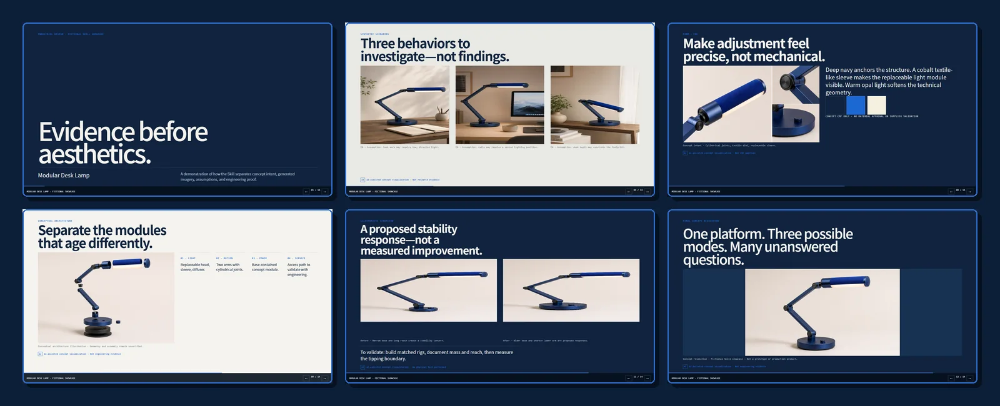

<div align="center">

# 工业设计作品集 Skill

### 把产品设计证据，整理成真正能够证明判断力的作品集。

简体中文 · [English](README.md)


</div>

这是一个以证据为核心的工业设计作品集 Agent Skill。它可以把用户研究、草图、CAD、CMF、模型、测试、制造记录和最终效果图，整理成结构清晰的横向 HTML 项目案例，同时不会为了“让项目看起来完整”而虚构不存在的设计过程。

> 精致效果图能展示审美；真正优秀的作品集，要让评审看见你发现了什么、改变了什么，以及为什么这个结果值得相信。

## 示例案例



**模块化桌面工作灯**是一套虚构的 14 页案例，用于展示 Skill 如何区分假设、概念意图、生成图、验证计划与工程证据。

| 输入 | Skill 工作流 | 输出 |
|---|---|---|
| 虚构任务书与 AI 辅助概念视觉 | 证据分级 → 故事地图 → 注册版式 → 披露检查 | 14 页响应式 HTML 作品集 |

[查看 HTML 案例](showcase/modular-desk-lamp/index.html) · [阅读故事板](showcase/modular-desk-lamp/storyboard.md) · [检查证据 manifest](showcase/modular-desk-lamp/portfolio_manifest.json)

> **虚构演示声明：** AI 辅助图像只用于表达设计意图，不是用户调研、实体原型、CAD、测试结果或工程证明。

## 它有什么不同

- **证据先于装饰**：重要结论必须对应来源、项目材料或明确标注的假设。
- **真正面向工业设计**：覆盖用户、造型、CMF、人体工学、产品架构、制造、原型与迭代。
- **作品集叙事工作流**：支持 12–18 页单项目、20–36 页多项目作品集和面试精简版。
- **18 种可直接复制的版式**：提供完整 HTML 骨架，覆盖设计任务书、证据墙、方案发散、选择矩阵、CMF、结构、制造、测试、迭代和最终方案。
- **内置 AI 披露机制**：AI 概念图不能被悄悄包装成用户研究、真实模型、CAD 或工程证据。
- **跨 Agent 兼容**：支持 Codex、Claude Code、Cursor、Gemini CLI、OpenCode 和通用 Agent Skills。
- **确定性的质量门槛**：包含 HTML 与 manifest 验证器、P0–P3 检查表、适配文件同步和六条可执行行为 rubric。

## 作品集工作流


工作流从五个相互关联的角度检查项目：

| 角度 | 作品集需要证明什么 |
|---|---|
| 用户与情境 | 用户需求来自观察，而不是事后编造 |
| 工业设计与 CMF | 造型和材料决策服务于明确目标 |
| 产品架构 | 零件、接口、装配和维修路径合理 |
| 制造与可行性 | 工艺、成本结论公开其假设条件 |
| 差异化与学习 | 展示方案、取舍、测试以及真实改变 |

## 最终产出

```text
portfolio/
├── index.html                 # 横向翻页、响应式网页作品集
├── images/                    # 调研、过程、CAD、原型、最终方案
├── portfolio_manifest.json    # 经 schema 校验的受众、职责、证据、假设、版式记录
└── source_notes.md            # 来源、署名、AI 披露、待验证问题
```

内置模板是一个单文件 HTML 作品集，支持键盘、滚轮、触屏、减少动效模式以及打印/PDF 导出。

## 快速安装

### Skills CLI

```bash
npx skills add truman-t3/industrial-design-portfolio-skill \
  --skill industrial-design-portfolio --global
```

### 克隆并安装

```bash
git clone https://github.com/truman-t3/industrial-design-portfolio-skill.git
cd industrial-design-portfolio-skill

# 根据你的 Agent 选择一项
python scripts/install_skill.py --platform codex --scope user
python scripts/install_skill.py --platform claude --scope user
python scripts/install_skill.py --platform cursor --scope user
python scripts/install_skill.py --platform gemini --scope user
python scripts/install_skill.py --platform opencode --scope user
```

安装到当前项目的通用目录：

```bash
python scripts/install_skill.py --platform agents --scope project
```

如果系统使用 `python3`，请将以上命令中的 `python` 替换为 `python3`。

## 使用示例

```text
使用 $industrial-design-portfolio，把我的调研记录、草图、CAD 截图和
模型照片整理成一个 14 页的工业设计项目案例。
```

```text
按照初级工业设计师求职标准评审我的 28 页作品集。
告诉我应该删什么、缺少什么证据，并重新规划页面顺序。
```

```text
从我的六个项目中选择三个，制作高级产品设计师求职作品集。
重点体现个人职责、制造协作和经过验证的设计迭代。
```

## 证据，而不是表演

Skill 使用四级证据体系：

| 等级 | 含义 | 作品集处理方式 |
|---|---|---|
| E0 | 没有支持材料的想法或模型建议 | 标记为“假设” |
| E1 | 用户提供但尚未核实的内容 | 标注来源和限制 |
| E2 | 直接项目证据 | 附带作者、情境和说明 |
| E3 | 可以独立验证的结果 | 标注来源和日期 |

视觉精致程度不会提高证据等级。AI 生成的爆炸图只能称为“概念结构示意图”，不能冒充可以制造的工程图。

## 跨 Agent 架构

`SKILL.md` 是唯一规范源，其他平台入口均由它生成：

```text
SKILL.md                 # Agent Skills 标准主文件
├── AGENTS.md            # Agent 通用持久指令入口
├── CLAUDE.md            # Claude Code 入口
├── GEMINI.md            # Gemini CLI 入口
├── agents/openai.yaml   # Codex UI 元数据
├── assets/              # 原创 HTML 作品集模板
├── references/          # 叙事、证据、版式、视觉、质检
├── scripts/             # 安装、同步、验证
├── schemas/             # portfolio manifest 契约
└── evals/               # 跨平台 rubric 与 fixture 观察结果
```

修改 `SKILL.md` 后重新生成并检查适配文件：

```bash
python scripts/sync_adapters.py
python scripts/sync_adapters.py --check
```

## 作品集验证

```bash
python scripts/validate_manifest.py path/to/portfolio/portfolio_manifest.json
python scripts/validate_portfolio.py path/to/portfolio/index.html
python scripts/validate_layout_library.py
python scripts/run_evals.py --all
```

`run_evals.py` 会把结构化评估观察结果与六条 rubric 对照；它不会声称自己执行了模型。P0 可信度问题和 P1 理解/可用性问题会阻止交付；P2、P3 作为设计完善建议报告。

## 设计原则

1. 展示设计决策，而不是流水账。
2. 优先保留真实材料，再考虑生成图像。
3. 区分设计意图与工程证明。
4. 团队项目必须写清个人职责。
5. 让版式适配证据形态，而不是为了丰富而变化。
6. 每个项目以最终方案和反思结束，而不是停在一张没有解释的效果图。

## 项目思想来源

这是一个原创实现，工作方法受到以下开源项目启发：

- [`michaelboeding/skills`](https://github.com/michaelboeding/skills/tree/master/skills/product-engineer-agent)：产品开发的多视角分析。
- [`op7418/guizang-ppt-skill`](https://github.com/op7418/guizang-ppt-skill)：叙事节奏、版式约束、图片槽位和分级质检。
- [`truman-t3/shijing-skill`](https://github.com/truman-t3/shijing-skill)：单一规范源、跨 Agent 适配、安装与 eval。

本项目没有复制 `guizang-ppt-skill` 的模板或源代码。

## 版本

当前预发布版本：**v1.2.0-rc.1**

- 以证据为核心的工业设计作品集工作流
- MIT 许可证，明确可复用范围
- 可校验证据、作者职责、AI 披露与版式的 manifest
- 原创响应式 HTML 横向作品集模板
- 18 种工业设计专用登记版式
- 跨 Agent 入口与安装器
- HTML/manifest 验证器与六条可执行行为 rubric
